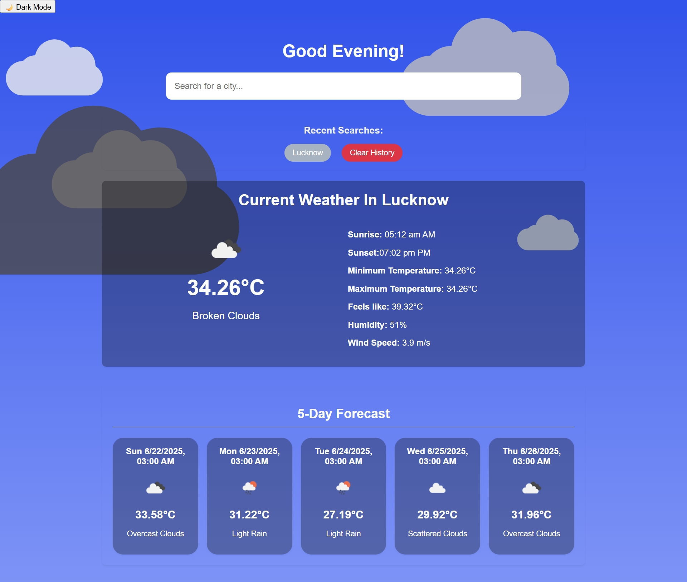
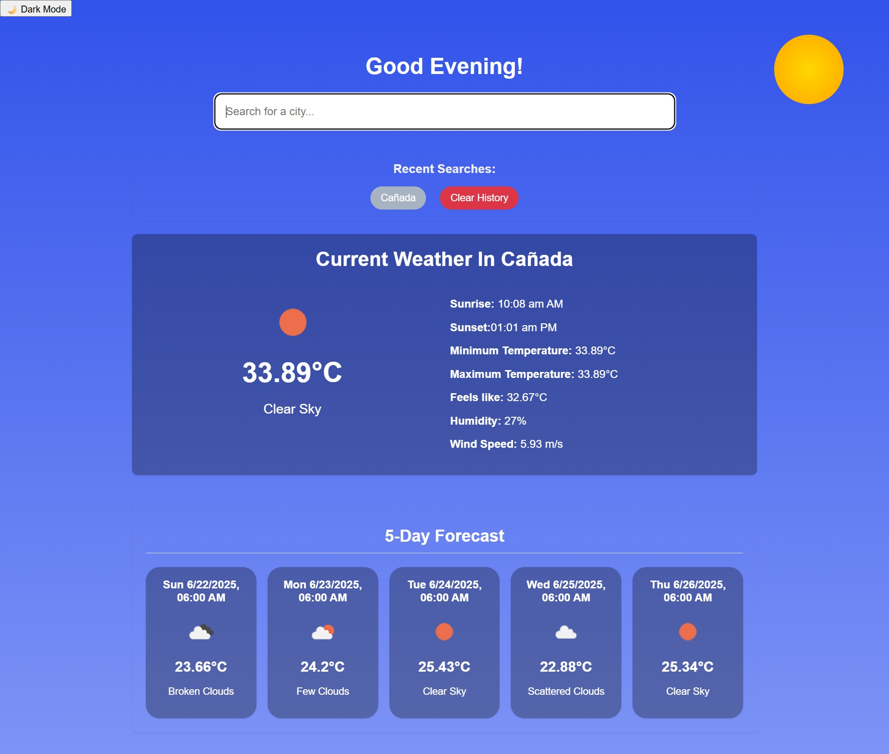
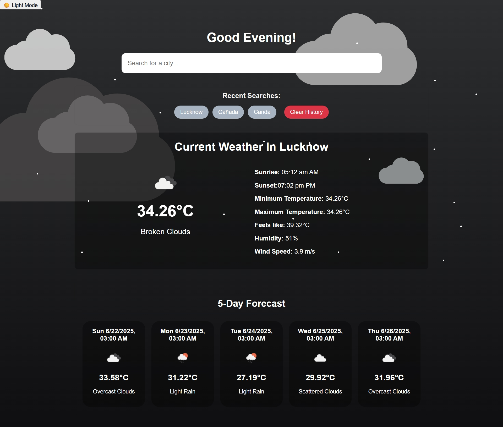

# Dynamic Weather Dashboard ([See Project](https://mak2506.github.io/weather-app/))
## 🌦️ Your Personalized Weather Companion
A responsive and interactive React.js application that provides real-time weather conditions and a 5-day forecast for any city worldwide. This dashboard goes beyond just displaying data, offering a dynamic sky environment and a seamless user experience.

---------------------------------------------------------------------------------------------------

## ✨Features
- <b>Real-time Weather Data:</b> Get up-to-the-minute weather details including temperature, "feels like," humidity, wind speed, pressure, and sunrise/sunset times.
  
- <b>5-Day Forecast:</b> Plan ahead with a comprehensive 5-day weather forecast, broken down by 3-hour intervals.
  
- <b>Automatic Geolocation:</b>Upon first load, the app automatically detects your location and fetches local weather data (with user permission).
  
- <b>City Search Functionality:</b> Easily search for weather conditions in any city by typing its name.
  
- <b>Recent City Searches:</b> Keeps track of your last 5 searched cities for quick access, persisted using Local Storage.
  
- <b>Dynamic Theme Toggle:</b> Switch effortlessly between a Light Mode (Day Theme) and a Dark Mode (Night Theme).
- <b>Interactive Sky Elements:</b>
    -  <b>Contextual Sun/Moon Display:</b> A vibrant sun or a tranquil moon appears dynamically based on the actual local time of the displayed city.
    - <b>Animated Stars:</b> Sparkle across the sky during nighttime.
    - <b>Dynamic Cloud Rendering:</b> Animated clouds gracefully float across the sky when weather conditions are cloudy, rainy, snowy, misty, or generally overcast.
- <b>Personalized Greeting:</b> Greets the user with "Good Morning," "Good Afternoon," or "Good Evening" based on the current time.
- <b>Responsive Design:</b> Optimized for a seamless experience across various devices and screen sizes.
- <b>Error Handling & Loading States:</b> Provides clear feedback to the user during data loading or if an error occurs.

- ------------------------------------------------------------------------------------------------------------
## 🚀 Technologies Used
- <b>Frontend Framework:</b> React.js (Functional Components, Hooks: useState, useEffect, useCallback, Custom Hooks)
- <b>Weather API:</b> OpenWeatherMap API (Current Weather Data & 5-Day / 3-Hour Forecast API)
- <b>Styling:</b> Pure CSS (with CSS Variables for dynamic theming, @keyframes for smooth animations, and responsive techniques)
- <b>Data Persistence:</b> Web Storage API (localStorage) for recent cities and theme preference.
- <b>Geolocation:</b> Browser's built-in Geolocation API

----------------------------------------------------------------------------------------------------------

## Here are some reference images

